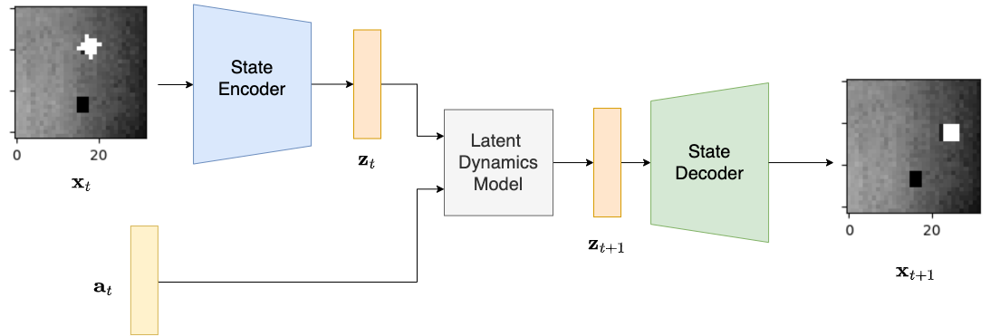
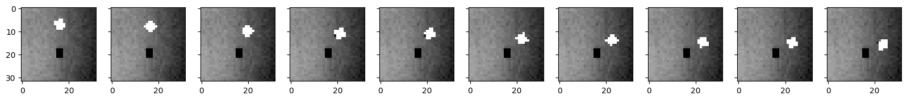
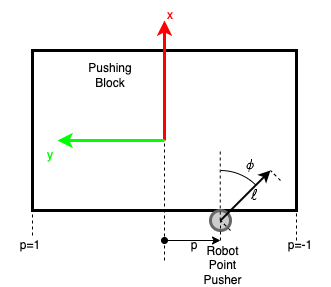
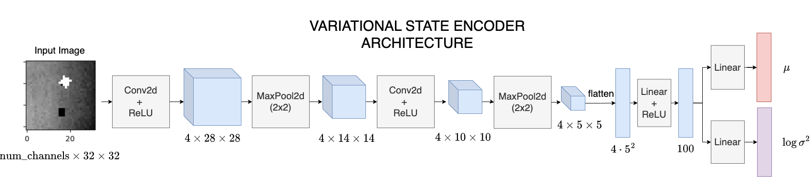
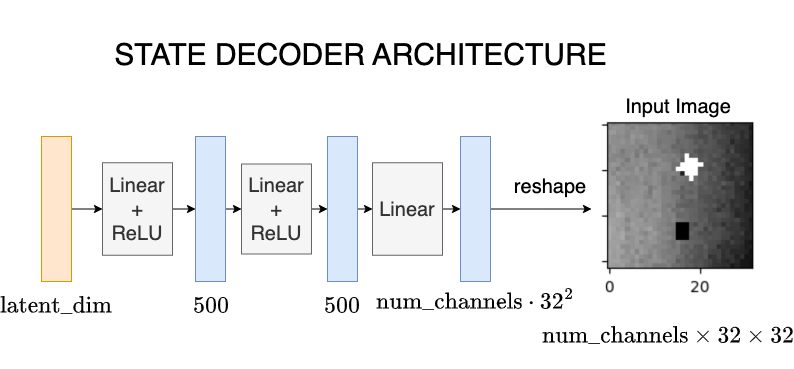
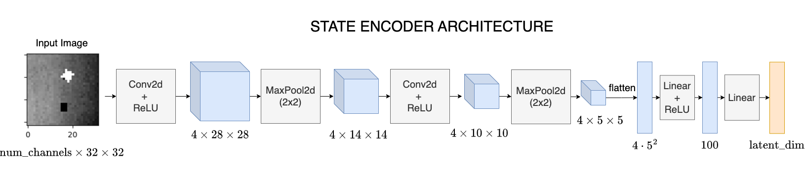
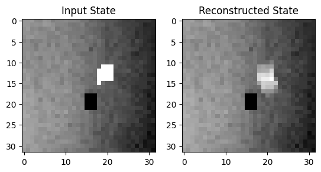

# Learning-latent-space-dynamics
Implementation of a Variational Autoencoder for learning latent space dynamics from images to push



### Data collection
The actions that are uniformly random sampled within the action space limits and the corresponding state are collected


### Action-Space
Each action 
```
$\mathbf u = \begin{bmatrix} p & \phi & \ell\end{bmatrix}^\top\in \mathbb R^3$ is composed by:
* $p \in [-1,1]$: pushing location along the lower block edge.
* $\phi \in [-\frac{\pi}{2},\frac{\pi}{2}]$ pushing angle.
* $\ell\in [0,1]$ pushing length as a fraction of the maximum pushing length. The maximum pushing length is is 0.1 m
```


## VAE
The VAE Encoder, which maps images to a Gaussian distribution over latent vectors is implemented. The encoder outputs $\mu$ and $\log\sigma^2$ which parameterize the latent distribution.The architecture is shown below:


### State Decoder


### State Encoder


## RESULTS
### Reconstructed image


### Image-based controller


